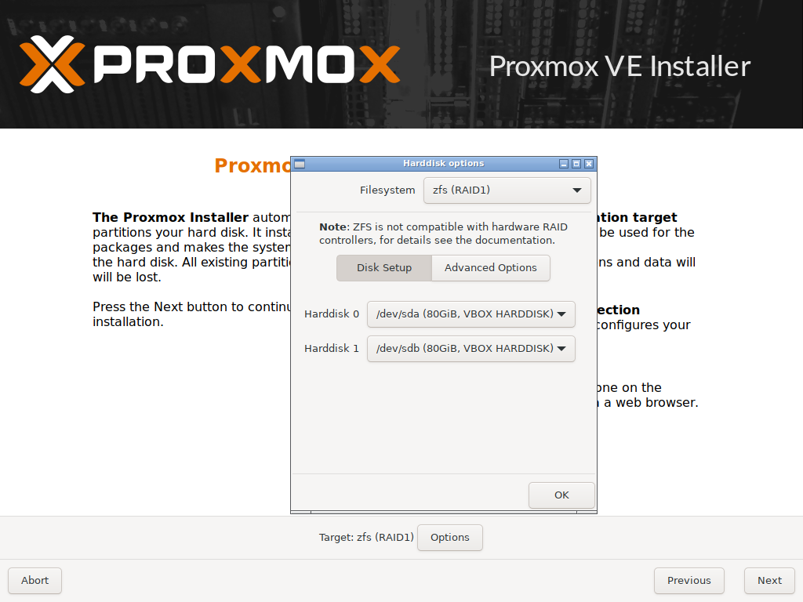

# OMV ZFS RAID NAS

## Summary

This method leads to a NAS booting [Openmediavault](https://www.openmediavault.org) 6 from a ZFS RAID root filesystem. If you want your OMV server to survive disk failure, the ability to rollback in case of software issues, better performance and less complexity compared to a VM, then this solution is for you 🙂 As long as you can live with the fact that this is an experimental configuration of OMV.

This installation method leverages the ability of the official [Proxmox](https://pve.proxmox.com) installer to create a ZFS RAID root filesystem. Proxmox supports installing additional operating systems inside Virtual Machines. We use the official OMV installation ISO to install OMV in a VM. So far this is a conventional installation process. Next comes the trick: moving the data from the OMV installation out of the virtual disk into its own ZFS dataset, then removing the Proxmox dataset. Combined with a new bootloader (ZFSBootMenu) the resulting system will have no traces of Proxmox left and is booting a clean installation of OMV with a ZFS root filesystem.

### Benefits

- **Redundancy.** If a disk dies, the NAS will continue to run and ZFS will send you an email notification.
- **Snapshots.** No need for a hypervisor to snapshot/rollback the OS installation. Automatic updates or misconfiguration could break the NAS. With snapshots and ZFSBootMenu it's easy to boot into a previous snapshot.
- **Performance.** Better performance compared to running OMV as VM.
- **Simpler** to maintain compared to running OMV in a VM. A single OS to maintain, instead of two. No need to pass through devices like your UPS and disks. Compatible with hot-swapping drives.
- **Cleaner** than [installing OMV 6 directly on top of Proxmox](https://forum.openmediavault.org/index.php?thread/41263-zfs-on-omv6/&postID=305603#post305603).
- **Easier** than manually installing Debian with root on ZFS via [debootstrap](https://openzfs.github.io/openzfs-docs/Getting%20Started/Debian/Debian%20Bullseye%20Root%20on%20ZFS.html).

### Downsides

- **Experimental**. Root on ZFS is not the default configuration for OMV. It is not well tested and [issues](https://github.com/Jip-Hop/OMV-ZFS-RAID/issues) may occur. Fewer people have experience with this setup, so there's less community support.
- **No ZFS encryption** for the root filesystem. I have developed [sedunlocksrv-pba](https://github.com/Jip-Hop/sedunlocksrv-pba) to provide encryption for my OMV installation. This requires the usage of Self Encrypting Drives. If you need to encrypt your OMV installation but can't use sedunlocksrv-pba, then this guide is not for you. In that case try to manually install Debian via via [debootstrap](https://openzfs.github.io/openzfs-docs/Getting%20Started/Debian/Debian%20Bullseye%20Root%20on%20ZFS.html).

## Installation Process

- [Install Proxmox with root on ZFS](#step-1-installing-proxmox)
- [Install Openmediavault 6 inside a Virtual Machine](#step-2-installing-the-omv-virtual-machine)
- [Prepare OMV for moving and shutdown VM](#step-3-prepare-omv)
- [Move OMV out of the VM into its own ZFS dataset](#step-4-move-omv-and-install-zfsbootmenu)
- [Setup ZFSBootMenu (basically dual-booting Proxmox and OMV)](#step-4-move-omv-and-install-zfsbootmenu)
- [Boot into OMV, destroy Proxmox dataset](#step-5-booting-omv-and-cleanup)
- [Enjoy OMV on ZFS!](#enjoy-omv-on-zfs--help-me-improve)

## Hardware Used

These instructions are known to work with the following hardware:

- Kontron/Fujitsu D3644-B
- Intel Pentium Gold G5420
- 4x 16GB Micron MTA18ADF2G72AZ-2G6 DDR4 ECC RAM
- 2x Samsung EVO 850 250GB SSD

## Prerequisites

To follow these instructions you need to have the following:

- PC/Server compatible with Proxmox and [UEFI](https://en.wikipedia.org/wiki/Unified_Extensible_Firmware_Interface)
- Proxmox ISO (tested with [proxmox-ve_7.1-2.iso](https://www.proxmox.com/en/downloads?task=callelement&format=raw&item_id=638&element=f85c494b-2b32-4109-b8c1-083cca2b7db6&method=download&args[0]=36adaf267a24a8a85835d0f0ac5d65fd))
- Openmediavault ISO (tested with [openmediavault_6.0-34-amd64.iso](https://sourceforge.net/projects/openmediavault/files/6.0-34/openmediavault_6.0-34-amd64.iso/download))
- USB stick to write Proxmox ISO to
- [Etcher](https://www.balena.io/etcher/) to write ISO to USB (or an alternative tool)
- Another computer to follow these instructions on
- Keyboard + mouse + monitor

## Step 1: Installing Proxmox

Write the Proxmox ISO to your USB stick with Etcher. Boot from the USB stick and follow the installation steps. When asked to choose the `Target Harddisk`, choose `Options` and select `zfs (RAID1)`. Select the 2 drives you want to install OMV to. If you have more than 2 drives, choose `-- do not use --` for the drives you don't want to use for the operating system.



Advanced users [may want](#suggestions) to decrease the hdsize under [Advanced Options](./screenshots/proxmox-disk-setup-advanced.png).

Hit `OK`, `Next` and complete the installation steps. The machine should automatically reboot after the installation is finished.

## Step 2: Installing the OMV Virtual Machine

After booting Proxmox visit the Web GUI at the address shown on screen, e.g. `https://192.168.1.3:8006/` and login with `root` and the password chosen during installation. Unfold the tree-view on the left and click on `local (hostname)`. Click on `ISO Images` -> `Upload`. Browse to the local folder where you've downloaded the Openmediavault ISO and click `Upload`.

Click on the `Create VM` button on the top right. Fill in the `Name` field -> `Next` -> select Openmediavault ISO for `ISO image` -> `Next` -> select `VirtIO-GPU` for `Graphic card` -> `Next` -> at the `Disks` step you don't need to change anything (I ticked `SSD emulation`, visible when checking `Advanced`, since my system is using SSDs) -> `Next` -> at the `CPU` step increase `Cores` if you like -> `Next` -> at the `Memory` step increase `Memory (MiB)` but leave some RAM left for the Proxmox host -> `Next` -> at the `Network` step you don't need to change anything -> `Next` -> `Confirm` your settings look similar:


Check `Start after created` and click `Finish`.

The VM `100 (omv)` appears in the tree view on the left. Click it and then click `Console` from the left sidebar. It should open noVNC showing the OMV installation screen. Complete the installation like a normal OMV installation. Upon completing the installation the VM will reboot. Check the ip address shown on the noVNC `Console` and connect via SSH.

## Step 3: Prepare OMV

Connect to the OMV Virtual Machine with SSH: `ssh root@192.168.1.4`. Replace `192.168.1.4` with the ip address found in the previous step. Login with the `root` password you choose when installing OMV. Read through the commands (and comments) shown below. You may copy-paste the entire script in the SSH terminal, or line by line (and skip the optional parts if you like).

```bash
#####
##### From a shell on the OMV Virtual Machine, run the following commands
#####

# Fix perl warnings (optional)
# In my case LC_CTYPE was set to "UTF-8" and LANG to "en_US.UTF-8"...
# Set LC_CTYPE to the same value as LANG to fix: "perl: warning: Setting locale failed"
# https://wiki.debian.org/Locale
echo "LC_CTYPE=$LANG" >> /etc/default/locale
export LC_CTYPE=$LANG

# Download omv-extras install script 
wget https://github.com/OpenMediaVault-Plugin-Developers/installScript/raw/master/install
chmod +x install

# Install omv-extras
sudo ./install -n # Skip network setup
rm install

# Install proxmox kernel for ZFS support (from omv-extras)
DEBIAN_FRONTEND=noninteractive apt install -y openmediavault-kernel
omv-installproxmox 

# Disable OMV beeps (optional)
systemctl stop openmediavault-beep-down
systemctl disable openmediavault-beep-down
systemctl stop openmediavault-beep-up
systemctl disable openmediavault-beep-up

# Disable tab completion beeps (optional)
echo "set bell-style none" >> /etc/inputrc
echo "set bell-style none" >> ~/.inputrc

# Reboot into kernel with ZFS support
reboot
```

After the VM has been rebooted, reconnect via SSH and run the commands below.

```bash
#####
##### From a shell on the OMV Virtual Machine, run the following commands
#####

# OMV was likely installed with swap partition, which won't be there after migrating
# Hence disable swap and remove from fstab to prevent trying to mount it
swapoff -a
sed -i '/swap/d' /etc/fstab
# UUID for swap is also placed in /etc/initramfs-tools/conf.d/resume
# Remove resume file to prevent "mdadm: No arrays found in config file or automatically" errors at boot
# https://forum.openmediavault.org/index.php?thread/21351-mdadm-no-arrays-found-in-config-file-or-automatically
# https://forum.openmediavault.org/index.php?thread/32649-remove-turn-off-folder2ram/&postID=239872#post239872
rm /etc/initramfs-tools/conf.d/resume

# NOTE: Need to update initramfs after disabling swap and deleting resume file
# But this is already done by installing zfs-initramfs below
# So there's no need to manually call: update-initramfs -c -k all

# Remove unused kernels
omv-removekernels
# Install zfs packages (zfs-initramfs is required to mount ZFS root dataset)
DEBIAN_FRONTEND=noninteractive apt install -y openmediavault-zfs zfs-initramfs

shutdown
```

## Step 4: Move OMV and install ZFSBootMenu

Now that OMV has been shut down, open `Shell` on Proxmox via the web interface.


Then run the following commands on the Proxmox host. You may copy-paste the entire script, or line by line. Ensure you change the variables at the top of the script to match your situation. Please read all the comments!

```bash
#####
##### From a shell on Proxmox, run the following commands (ensure omv has been shutdown)
#####

EFIPARTITIONS=( sda2 sdb2 ) # Edit this array to match the EFI partitions of the disks in the boot zpool (check with: lsblk)
ZPOOL="rpool" # Should match name of ZFS root pool (check with: zpool list)
VMPARTITION="zd0p1" # Partition name of disk used by the OMV VM (check with: lsblk)
PVEROOT="$ZPOOL/ROOT/pve-1" # Should match name of proxmox root dataset (check with: zfs list)
EFIBINARY="https://github.com/zbm-dev/zfsbootmenu/releases/download/v1.12.0/zfsbootmenu-release-vmlinuz-x86_64-v1.12.0.EFI"

# Download EFI binary
curl -fSL $EFIBINARY -o /tmp/bootx64.efi
mkdir -pv /tmp/boot/efi

# Do this for each disk in the ZFS boot array
# https://www.osso.nl/blog/zfs-zvol-partition-does-not-show-up/
for EFIPARTITION in "${EFIPARTITIONS[@]}"
do
   : 
	mount "/dev/$EFIPARTITION" /tmp/boot/efi
    # Remove everything in /tmp/boot/efi
    rm -r /tmp/boot/efi/*
	mkdir -pv /tmp/boot/efi/EFI/boot/

	# Copy EFI binary to all disks, to prevent it being a single point of failure
	cp -v /tmp/bootx64.efi /tmp/boot/efi/EFI/boot/bootx64.efi
	umount "/dev/$EFIPARTITION"
done

mkdir /tmp/src
mkdir /tmp/dst

# Enable autotrim for SSDs (should be ignored by HDDs)
zpool set autotrim=on $ZPOOL

# Create dataset for OMV
# Don't follow the rpool/ROOT/ naming convention (optional when using ZFSBootMenu)
# https://www.reddit.com/r/zfs/comments/kxruhp/comment/gjc79dk/
zfs create -o canmount=noauto $ZPOOL/omv

# Create dataset for Docker (which manages its own datasets & snapshots)
zfs create -o com.sun:auto-snapshot=false -o mountpoint=/var/lib/docker rpool/docker

# Mount source
mount /dev/$VMPARTITION /tmp/src

# Mount destination
zfs set mountpoint=/tmp/dst $ZPOOL/omv
zfs mount $ZPOOL/omv

# Ensure destination is empty
rm -rf /tmp/dst/*
# Copy OMV installation from the VM to the ZFS dataset (retain all attributes, symlinks not dereferenced)
cp --archive -v /tmp/src/* /tmp/dst
# Clear fstab file (no need to mount root filesystem via fstab)
echo "" > /tmp/dst/etc/fstab

sync

umount /tmp/src
umount /tmp/dst

# Set the mountpoint to the new root directory 
zfs set mountpoint=/ $ZPOOL/omv
# Set the default boot environment to tell ZFSBootMenu what it should prefer to boot
zpool set bootfs=$ZPOOL/omv $ZPOOL
# Set canmount=noauto on proxmox dataset
zfs set canmount=noauto $PVEROOT

# Create snapshot of clean OMV installation
zfs snapshot $ZPOOL/omv@install

reboot
```

## Step 5: Booting OMV and cleanup

The system will now reboot into the ZFSBootMenu. When booting into ZFSBootMenu for the first time, the pool won't be automatically imported. You'll be dropped into an emergency shell, from which you should run the following commands to force importing the zpool:

```bash
#####
##### Inside ZFSBootMenu
#####

zpool import -af
exit
```

ZFSBootMenu will display a warning:

```
Using KCL from /etc/default/grub on pool rpool/omv
This behavior is DEPRECATED and will be removed soon

KCL should be migrated to an org.zfsbootmenu:commandline property.

Will attempt migration in 60 seconds
```

Wait for the timer to complete or press `Enter` to allow the migration. The same message will show up for the Proxmox installation. Press `Enter` again.

> NOTE: I allowed ZFSBootMenu to migrate and didn't see the warning since then. I tried running: `update-grub`, which completed successfully (even though GRUB is not used as bootloader). System could still boot successfully afterwards.

> TODO: Figure out how to prevent this warning. Ensure it doesn't break when deprecated behavior is removed.

Select `rpool/omv` and press `Enter`. The system should now boot directly into Openmediavault instead of Proxmox. At this stage you basically have a system dual-booting Proxmox and Openmediavault. I haven't tested Proxmox much to confirm it works properly. Since we don't need it anymore we'll remove Proxmox now and fix some things on OMV.

Unfortunately at this point network setup is broken, so we need to login to the terminal on OMV as `root` user and run `omv-firstaid`.

```bash
#####
##### From the OMV terminal, run the following commands
#####

# Configure network interface
omv-firstaid # Select option 1 `Configure network interface` -> `OK` -> `OK` -> Select `Yes` for `Do you want to configure IPv4 for this interface?` -> `Yes` -> `No` -> `No`

# Show the assigned ip address (will likely be the same ip address you use to access the Proxmox Web GUI)
ip addr show
```

You can now login with SSH: `ssh root@192.168.1.3`. Replace `192.168.1.3` with the ip address found in the previous step. Login with the `root` password you chose when installing OMV. Complete the installation by running the commands below.

```bash
#####
##### From a shell on OMV, run the following commands
#####

# Remove Proxmox datasets
zfs destroy -r rpool/data
zfs destroy -r rpool/ROOT
```

All done! You can now login to the Openmediavault Web GUI with username `admin` and password `openmediavault` (don't forget to change those credentials ;).

> NOTE: OMV6 dashboard widget settings are [stored client side](https://forum.openmediavault.org/index.php?thread/42417-empty-dashboard-after-reboot/) (in the browser). So the widgets page will be empty in a private window or in another browser and lost when browser settings are cleared.

## Enjoy OMV on ZFS! (& Help Me Improve)

Any help with testing, fixing issues and improving this installation method is very much appreciated 🙂. You can read about my [Motivation](motivation.md#motivation) for choosing this method and the considered [Alternatives](motivation.md#alternatives). I've also written down some [Snapshot Restore](./restore.md#snapshot-restore) steps and [Suggestions](suggestions.md#suggestions) on what to do next (or how to install things a bit differently).